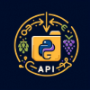

# Tech Challenge 1 (Fase 1): API Viticultura Embrapa 1970-2024

#  
  # Sobre o Projeto

**Tech Challenge** é um projeto que reúne a aplicação dos conhecimentos adquiridos em todas as disciplinas de uma fase da Especialização em Machine Learning Engineering da FIAP PosTech.

Para o Tech Challenge 1, o desafio proposto foi o seguinte:

> 📢 **Problema:** Você foi contratado(a) para uma consultoria e seu trabalho envolve analisar os dados de vitivinicultura da **Embrapa Uva e Vinho** que é um centro de pesquisa da Embrapa (Empresa Brasileira de Pesquisa Agropecuária). Este centro mantém um site que disponibiliza dados sobre a Viticultura no Brasil, como produção de uvas, vinhos e sucos, além de estatísticas do setor desde 1970.

**Link do site:** [Embrapa Vitivinicultura](http://vitibrasil.cnpuv.embrapa.br/index.php?opcao=opt_01)

**Proposta do desafio:**
A proposta do projeto é criar uma **API pública** para consulta nos dados disponíveis no site da Embrapa nas respectivas abas:

- Produção
- Processamento
- Comercialização
- Importação
- Exportação

API desenvolvida será utilizada para alimentar uma base de dados que, futuramente, servirá para um modelo de **Machine Learning**.

## 📌 Objetivos

- Criar uma Rest API em Python** que faça a consulta nos dados disponíveis no site da Embrapa.
- Documentar a API para facilitar o uso e compreensão.
- Recomendações (não obrigatórias):** Adotar um método de autenticação, como **JWT**.
- Elaborar um plano para o deploy da API, incluindo:
  - **Arquitetura do projeto:** Desde a ingestão até a alimentação do modelo de Machine Learning (não é necessário criar o modelo de ML nesta fase).
  - Escolher um cenário relevante onde a API será utilizada.
- Criar um **MVP (Minimum Viable Product):**
  - Realizar o deploy com um link acessível e compartilhável.
  - Disponibilizar o código em um repositório no **GitHub**.

## Possíveis dores

- Falta de padronização para acesso aos dados bem como tipos de retornos e formatos mais adequados para consumo na produção de relatórios e analytics.
- Suporte e documentação insuficientes.
- Indisponibilidade de dados por instabilidade do site da Embrapa.
- Ausência de método de autenticação para acesso ados dados.

## Proposta de solução

Em face ao desafio proposto, algumas funcionalidades propostas para a API são:

- Coleta automática e atualizada de dados do site Vitibrasil da Embrapa Uva e Vinho.
- Armazenamento dos dados extraídos do site Vitibrasil para garantia de disponibilidade (fallback).
- Fornecimento de endpoints para consulta de dados de diversas fontes tais como Produção, Processamento, Comercialização, Importação e Exportação, podendo filtrar por ano.
- Cenários futuros: são propostos modelos de Machine Learning (ML) para implementação futura, para as diversas fontes de dados.

## 📂 Estrutura do projeto

```
.
└── TECHCHALLENGE01/
    ├── api/
    └── data/
       └── data_offline/
          └── comercializacao/
              |- producao.csv
          └── exportacao/
              |- espumantes.csv
              |- suco_uva.csv
              |- uvas_frescas.csv
              |- vinhos_mesa.csv
          └── importacao/
              |- espumantes.csv
              |- suco_uva.csv
              |- uvas_frescas.csv
              |- vinhos_mesa.csv
          └── processamento/
              |- americanas_hibridas.csv
              |- sem_classificacao.csv
              |- uvas_mesa.csv
              |- viniferas.csv
          └── producao/
              |- producao.csv

        ├── src/
        └── autenticacao/
            |- __init__.py
            |- decoradores.py
            |- manipulador_jwt.py
            |- rotas_autenticacao.py
        └── flask_api/
            |- __init__.py
            |- rotas_api.py
        └── scraper/
            |- __init__.py
            |- obtem_dados_offline.py
            |- trata_dados.py
            |- urls.py
            |- webscraping.py
        └── scraper/
            |- test_api.py
            |- test_scraper.py
    |- __init__.py
    |- app.py
    |- index.py
    |- requirements.txt

    ├── collection_insomnia/
    |   - collection_insomnia/Insomnia_2025-04-03.yaml
    └── docs/
        └── arquitetura/
            |-Projeto61.pdf
            |-Projeto61.drawio 
        └── imagens/
            |- logo61.png 

    |- gitignore
    |- estrutura.txt
    |- note.txt
    |- pytest.ini
    |- README.md
    |- vercel.json    
```


## 🔩 Arquitetura da solução

A arquitetura da solução foi desenhada sob uma abordagem End-to-end e consta na pasta de documentação deste repositório. 
[Arquitetura](https://github.com/Grupo-61/techchallenge01/blob/main/docs/arquitetura/Projeto61.pdf)


## 🛠️ Instalação do projeto local

Clonando o projeto localmente

``` bash
$ git clone https://github.com/Grupo-61/techchalenge01.git
```

Criando um ambiente virtual

``` bash
$ python -m venv venv
```

Ativando o ambiente virtual

``` bash
$ source venv/Scripts/activate 
```

Instalação das depêndências

``` bash
$ pip install -r requirements.txt
```

Executando o servidor Flask a partir do diretório raiz do projeto

``` bash
$ flask run
```

Ou executar com o debug ativado

``` bash
$ flask run --debug
```

Testando as consultas localmente via navegador

Link: http://127.0.0.1:5000/comercializacao/ano=2016


### 📋 Como testar localmente com o Vercel:
- Instalar Node.js `https://nodejs.org/pt`

1. Instale o Vercel CLI:
   ```bash
   npm install -g vercel

2. Login no Vercel
```bash
vercel login


2. Execute o projeto localmente:
   ```bash
    vercel dev

3. Acesse:
   ```bash
    http://localhost:3000/api

# Depêndencias

Para o desenvolvimento deste desafio, foram utilizadas a seguintes bibliotecas e frameworks:
- Backend: Flask
- Documentação da API: Flassger - Swagger para Flask
- Autenticação: Flask-JWT-Extended
- Modularização: além de separação em componentes, também foi usado Blueprint
- Registro de Log: Logger
- Webscraping: BeatifulSoap


## ⚙️ Configuração e implantação 
 ### Vercel
     - O arquivo vercel.json configura o Vercel para rodar o arquivo app.py como ponto de entrada da aplicação, expondo as rotas Flask para acesso externo via URL gerada pelo Vercel. Assim, ao fazer deploy, a API fica acessível publicamente pelo endereço fornecido pela Vercel

 ### Testes Unitários
    - Com as bibliotecas `pytest` e `unittest` instaladas
    - Executar o seguinte comando no terminal na raiz do projeto
    - Incluir cenários de testes

```bash
python -m pytest
```

# Autenticação

Autenticação básica com `httpauth`


Instalação:

``` bash
$ pip install flask-httpauth
```

## 📜 Swagger
    Utilizado para documentar automaticamente todas as rotas da API Flask, facilitando o uso e integração com outras aplicações. Essa documentação torna mais compreensível os parâmetros de chamada e retornos.
    [Documentação:](https://techchallenge01-ulissesphs-projects.vercel.app/apidocs/)


## 🌐 Insominia
    O Insomnia é uma ferramenta para testar APIs REST. Ele permite que você envie requisições HTTP (GET, POST, etc.) para sua API, visualize as respostas, organize coleções de endpoints e simule diferentes cenários de uso, como autenticação, envio de parâmetros e cabeçalhos. No seu projeto, o Insomnia está sendo usado para testar e validar as rotas da API localmente, facilitando o desenvolvimento e o debug

## ✒️ Autores

## Autores

- [Ana Paula de Almeida](https://github.com/Ana9873P)
- [Augusto Omena](https://github.com/AugustoOmena)
- [Bruno Gabriel de Oliveira](https://github.com/brunogabrieldeoliveira)
- [José Walmir Gonçalves Duque](https://github.com/WALMIRDUQUE)
- [Pedro Henrique da Costa Ulisses](https://github.com/ordepzero)


## 📄 Licença

Este projeto está licenciado sob a Licença MIT.  
Consulte o arquivo [license](docs/license/license.txt)  para mais detalhes.